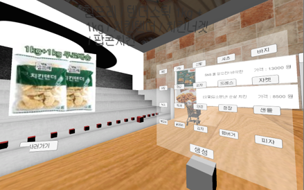
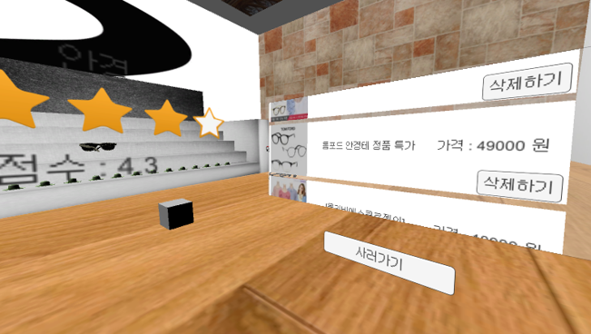

# UOS Senior Project : VR SHOPPING

이 프로젝트는 서울시립대 컴퓨터과학부 졸업 작품 VR SHOPPING 프로젝트입니다.

해당 프로젝트는 OS: Windows 10, cpu : i5-2500, graphic card: GTX 960, RAM 8GB 환경에서 개발되었습니다.

프로젝트 개발 버전 : UnityEngine(Ver.2017.1.0p5) & VisualStudio 2017

이 프로젝트는 E커머스 11번가 API를 통해 DATA를 받아 유니티 월드상으로 구현하는 내용을 담고 있습니다.

해당 코드의 설명은 "XMLTest"라는 이름의 Script안에 자세히 써져있으므로 참고하시기 바랍니다. (이 코드는 Assets/Script 폴더 안에 존재합니다.)

# 개념 설계안

```
1. 아이템 생성
11번가에 검색해서 나오는 판매 아이템들의 관한 정보 리스트를 받아서, GameObject에 데이터들을 저장함.
1.1 기본 흐름
1) 비어있는 아이템 진열장으로 사용자가 접근.
2) 사용자가 원하는 아이템을 검색, 혹은 미리 지정한 검색어 버튼을 눌러 아이템을 검색
3) 사용자가 입력한 정보를 토대로 나온 물품 정보에 맞는 약 20 개의 아이템 오브젝드들이 진열장 위에 생성됨.

1.2 대안 흐름 : 사용자가 이미 아이템이 진열된 진열장을 다른 아이템으로 변경하고 싶어함
1) 사용자가 다른 정보를 입력, 혹은 버튼을 눌러 다른 아이템을 검색.
2) 기존에 있던 아이템 오브젝트들은 전부 사라지고, 검색어에 맞는 다른 아이템 오브젝트이 생성됨
```

```
2. 아이템 선택
아이템을 가리키면 해당 아이템을 선택할 수 있음.

2.1 기본 흐름
1) VR 컨트롤러의 커서를 아이템 위에 올려놓음.
2) 선택된 아이템의 색상이 약간 변함.
3) 선택한 아이템의 위에 아이템 정보를 간략하게 보여주는 UI 박스가 생성됨.
4) 아이템을 선택하면 아이템 상세 정보 보기로 넘어감.
4-2) 커서를 다른 곳으로 돌리면 아이템의 색상이 원상태로 돌아옴. 또한 UI 박스가 사라짐.
```

```
3. 아이템 정보 상세 보기
아이템의 명칭, 아이템에 관한 Image정보, 아이템 구입 할 수 있는 웹페이지 URL과 아이템의 3d Mesh와 그와 비슷한 아이템의 정보를 사용자가 VR UI를 통해 볼 수 있다.
3.1 기본 흐름
1) 커서를 통해 선택한 아이템을 클릭하면 상세정보 보기위한 UI가 유저 눈 앞에 생성됨.
2) UI의 정보는 선택한 아이템의 값을 읽어서 그대로 보여줌

3.2 대안 흐름 : 비슷한 아이템을 선택하고 싶을 때
1) 사용자가 오른쪽에 보이는 스크롤 뷰에서 비슷하면서 자신이 원하는 아이템의 목록을 봄.
2)사용자가 원하는 아이템을 스크롤 뷰에서 찾으면 그 이미지를 커서에 올리고 누름
3)UI에서 보여줬던 아이템의 정보가 사용자가 선택한 아이템으로 변함.
```
```
4. 장바구니
사용자가 아이템을 드래그하여, 장바구니에 집어넣으면 자신이 선택한 아이템 정보를 저장할 수 있으며, VR 프로그램을 나갔다 들어와도 그 정보를 불러와서 편리하게 사용할 수 있다.

4.1 기본 흐름
1) 사용자가 원하는 아이템임을 결정하고, 아이템 결정 버튼을 클릭.
2) 정보보기 UI가 사라지고, 사용자 눈 앞에 3D Mesh만 남음.
3) 3D Mesh를 드래그하여 카트에 담는다.
4) 카트안에 아이템이 들어오면, 해당하는 아이템의 정보를 저장하며, 3D Mesh는 삭제된다.

4.2 대안 흐름 : 카트안의 아이템을 없애고 싶을 때
1) 카트 안에 있는 아이템을 선택
2) 그 아이템을 드래그 한 후, 카트가 아닌 바닥에 해당 아이템을 떨군다.
3) 카트는 아이템의 갯수가 줄어들면, 사용자가 뺀 아이템을 장바구니에서 제거한다.
4) 떨어트린 아이템은 몇 초가 지나면 사라진다.
```

# 시연 이미지




# 주의

이 프로젝트는 개발 환경 문제상의 이유로 인해, VR 기기를 사용하는 것을 염두하고 개발하였지만,

컨트롤러가 없는 관계로 UI의 기능을 전혀 사용 할 수 없어서 VR SDK의 내용을 전부 지우고 컴퓨터의 마우스 키보드 환경에서 시연할 수 있도록 만들었습니다.

사용했던 VR기기는 Oculus DK2로, 연구실에서 교수님께 대여를 받아 사용하였습니다.

1. https://www.oculus.com/setup/ 이 주소에 들어가 Rift 소프트웨어를 다운받아 설치

2. https://developer.oculus.com/downloads/ 이 주소에서 Unity SDK를 다운받아 Unity 프로젝트에 적용

이 단계를 거친 뒤에, Player에 관련된 Script를 Oculus 환경에 맞게 적용하면 사용이 가능한 프로젝트입니다.
